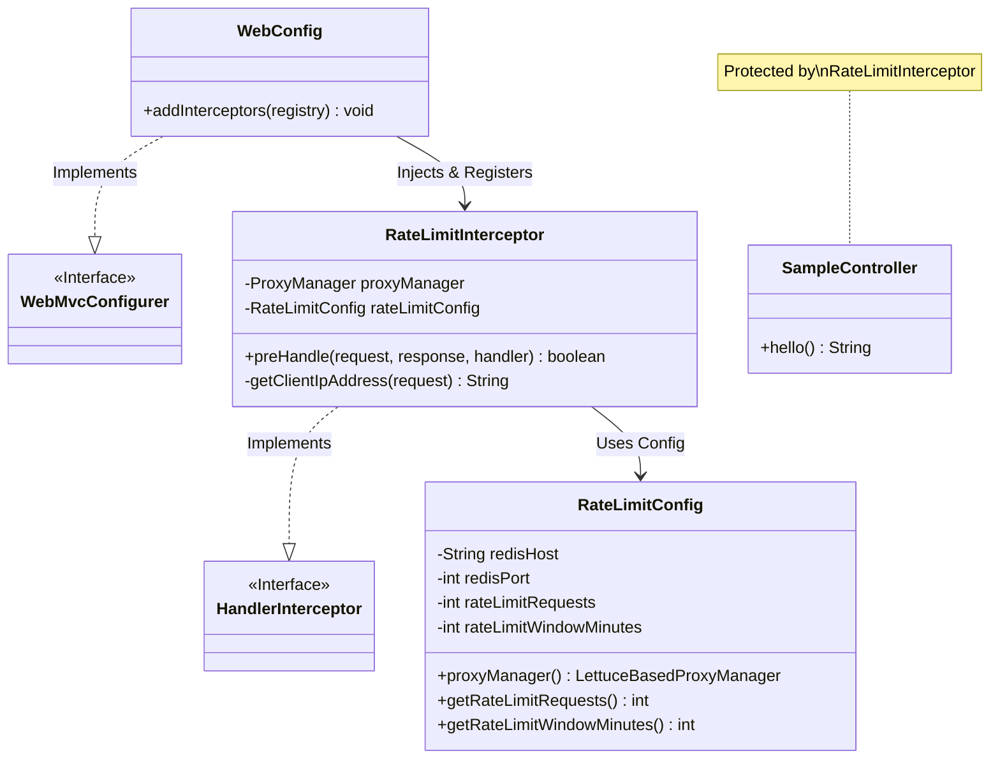
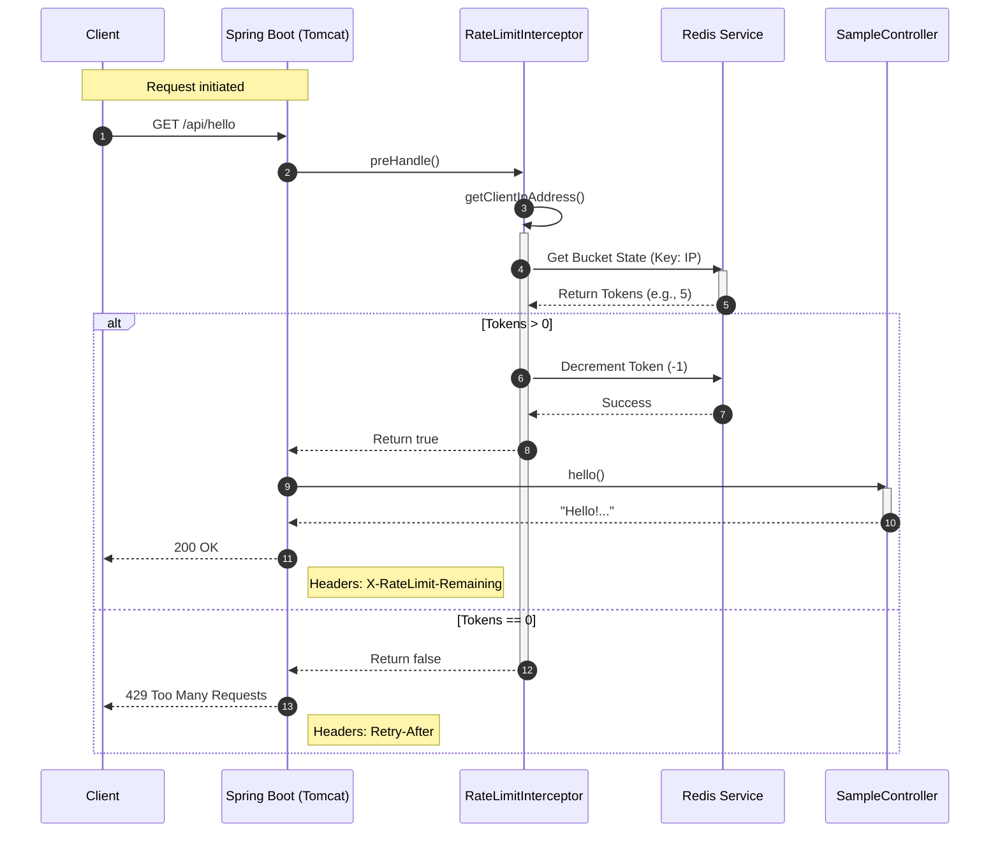
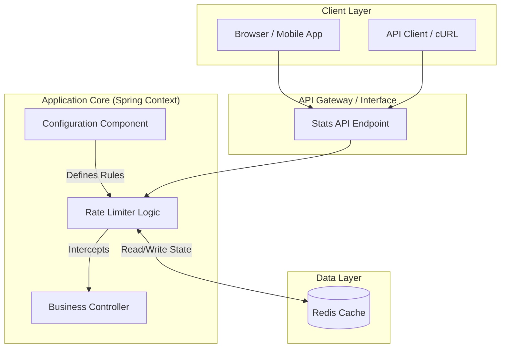
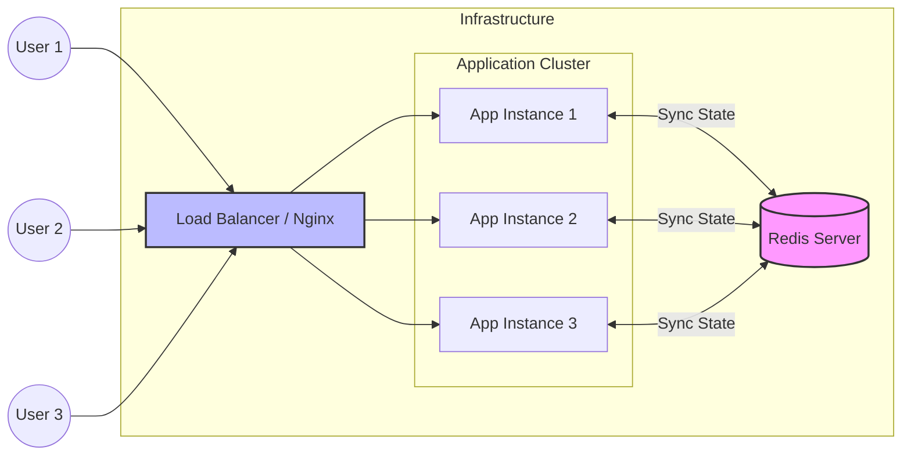
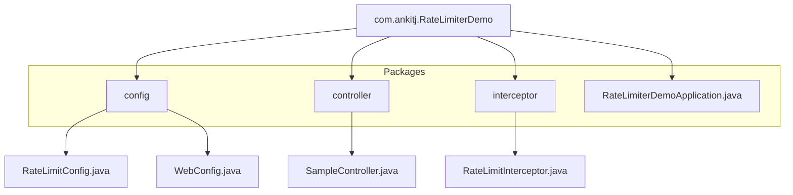

# Solution Architecture & Diagrams

This document details the architectural design of the **Rate Limiter Demo**. It includes visual models to help understand the code structure, runtime behavior, and deployment strategy.

---

## 1. Class Diagram (Static View)

This diagram shows the code structure: how classes are related, what dependencies they inject, and their main responsibilities.

### Explanation
- **WebConfig** allows us to hook into the Spring MVC pipeline.
- It registers the **RateLimitInterceptor**.
- The **Interceptor** relies on **RateLimitConfig** to know the rules (limit/window) and to access the **ProxyManager** (Bucket4j) for checking Redis.

---

## 2. Request Flow (Sequence Diagram)

This diagram illustrates the step-by-step lifecycle of a single HTTP request.

---

## 3. Overall Architecture (Component View)

This view shows how the application is constructed from a logical component perspective and how it handles data.

---

## 4. Solution & Deployment Architecture

This diagram shows how the solution would look in a real-world production environment with horizontal scaling.

### Why this structure?
- **Stateless Application:** The Spring Boot API has no internal state about the user.
- **Centralized State:** Redis acts as the "Single Source of Truth".
- **Result:** If User 1 makes 5 requests to Instance 1, and then 5 requests to Instance 2, Redis knows they have made 10 total. They will be blocked correctly, regardless of which server they hit.

---

## 5. Directory Package Structure

A visual representation of the codebase organization.

